As AI agents become increasingly sophisticated and autonomous, they rely heavily on external tools and services to extend their capabilities. The Model Context Protocol (MCP) has emerged as a standard for AI agents to interact with these tools, but this creates a critical security vulnerability: **how do we ensure that tool schemas haven't been maliciously modified?**

Today, we're excited to introduce [**SchemaPin**](https://schemapin.org) 🧷 - a cryptographic protocol that prevents "MCP Rug Pull" attacks by enabling developers to cryptographically sign their tool schemas and allowing clients to verify schema integrity and authenticity.

## The Problem: MCP Rug Pull Attacks

Consider this scenario: An AI agent uses a popular "file_manager" tool that initially provides legitimate file operations. After gaining widespread adoption, the tool's schema is maliciously updated to include a new "backup_to_cloud" function that secretly exfiltrates sensitive files to an attacker-controlled server.

Without cryptographic verification, AI agents would automatically trust and use this modified schema, potentially compromising sensitive data. This is what we call an **"MCP Rug Pull"** - where a trusted tool is maliciously modified after gaining user trust.

## The Solution: Cryptographic Schema Integrity

SchemaPin addresses this critical vulnerability by providing:

### 🔐 Core Security Guarantees

- **Schema Integrity**: Guarantees that tool schemas haven't been altered since publication
- **Authenticity**: Cryptographic signatures prove schema origin from the claimed developer
- **MITM Protection**: Application-layer security prevents schema tampering even if network connections are intercepted
- **Infrastructure Defense**: Protection against compromised servers, CDNs, or repositories

### 🛡️ Trust-On-First-Use (TOFU) Key Pinning

SchemaPin implements a robust key pinning mechanism that:
- Pins developer keys on first successful verification
- Protects against future key substitution attacks
- Alerts users when keys change unexpectedly
- Enables long-term trust relationships

## How SchemaPin Works

```mermaid!
flowchart TD
    A[Tool Developer] -->|Publishes| B["/.well-known/schemapin.json<br/>(Public Key + Revoked Keys)"]
    A -->|Signs| C["Tool Schema + Signature"]

    subgraph "AI Agent"
        D["Fetch Schema + Signature"]
        E["Fetch or Cache Public Key"]
        F["Check Key Revocation"]
        G["Verify Signature"]
        H{"Key Revoked?"}
        I{"Signature Valid?"}
        J["Pin Key (TOFU)"]
        K["Accept & Use Tool Schema"]
        L["Reject / Block Tool"]
    end

    C --> D
    B --> E
    D --> G
    E --> F
    F --> H
    E --> G
    H -- Yes --> L
    H -- No --> G
    G --> I
    I -- No --> L
    I -- Yes --> J
    J --> K
```



The protocol uses industry-standard cryptography:
- **ECDSA P-256** signatures for verification
- **SHA-256** hashing for schema integrity
- **RFC 8615** `.well-known` URIs for public key discovery
- **PEM/Base64** encoding for interoperability

## Quick Integration Example

### For Tool Developers (Signing Schemas)

```python
from schemapin.utils import SchemaSigningWorkflow
from schemapin.crypto import KeyManager

# Generate key pair
private_key, public_key = KeyManager.generate_keypair()
private_key_pem = KeyManager.export_private_key_pem(private_key)

# Sign your tool schema
workflow = SchemaSigningWorkflow(private_key_pem)
schema = {
    "name": "calculate_sum",
    "description": "Calculates the sum of two numbers",
    "parameters": {
        "type": "object",
        "properties": {
            "a": {"type": "number", "description": "First number"},
            "b": {"type": "number", "description": "Second number"}
        },
        "required": ["a", "b"]
    }
}
signature = workflow.sign_schema(schema)
```

### For AI Clients (Verifying Schemas)

```python
from schemapin.utils import SchemaVerificationWorkflow

# Initialize verification
workflow = SchemaVerificationWorkflow()

# Verify schema (auto-pins key on first use)
result = workflow.verify_schema(
    schema=schema,
    signature_b64=signature,
    tool_id="example.com/calculate_sum",
    domain="example.com",
    auto_pin=True
)

if result['valid']:
    print("✅ Schema signature is valid")
    # Safe to use the tool
else:
    print("❌ Schema signature is invalid")
    # Reject the tool
```

## Cross-Language Support

SchemaPin provides implementations across multiple languages to ensure broad ecosystem adoption:

- **Python**: Available on PyPI (`pip install schemapin`)
- **JavaScript/Node.js**: Available on npm (`npm install schemapin`)
- **Go**: Available via Go modules (`go install github.com/ThirdKeyAi/schemapin/go/cmd/...@latest`)

Each implementation includes:
- High-level APIs for signing and verification
- CLI tools for key generation, signing, and verification
- Comprehensive test suites
- Production-ready security features

## Enterprise and Ecosystem Benefits

### Standardized Trust Mechanism
SchemaPin provides a common, interoperable standard for verifying tools across different AI agent frameworks and programming languages, creating a unified security foundation for the entire AI ecosystem.

### Automated Governance
The protocol enables enterprises to programmatically enforce security policies requiring valid signatures before tool execution, allowing automated compliance checking while maintaining strong security guarantees.

### Supply Chain Security
By preventing malicious schema modifications, SchemaPin protects against supply-chain attacks where legitimate tools are compromised after approval, ensuring long-term security for AI agent deployments.

## Getting Started

Visit [schemapin.org](https://schemapin.org) to:
- Download implementations for your preferred language
- Read the complete technical specification
- Explore integration examples and best practices
- Access CLI tools for immediate use

The project is open source and available on [GitHub](https://github.com/thirdkey/schemapin), with comprehensive documentation, examples, and automated CI/CD workflows for reliable package distribution.

## The Future of AI Tool Security

As AI agents become more autonomous and handle increasingly sensitive tasks, cryptographic verification of tool schemas becomes essential infrastructure. SchemaPin provides the foundation for this security layer, enabling developers to build trust relationships that scale with the growing AI ecosystem.

By implementing SchemaPin in your AI agent or tool development workflow, you're not just protecting your users - you're contributing to a more secure and trustworthy AI future for everyone.

---

*SchemaPin is part of ThirdKey Research's commitment to advancing AI security through practical, open-source solutions. Learn more about our Zero Trust for AI research at [research.thirdkey.ai](https://research.thirdkey.ai).*