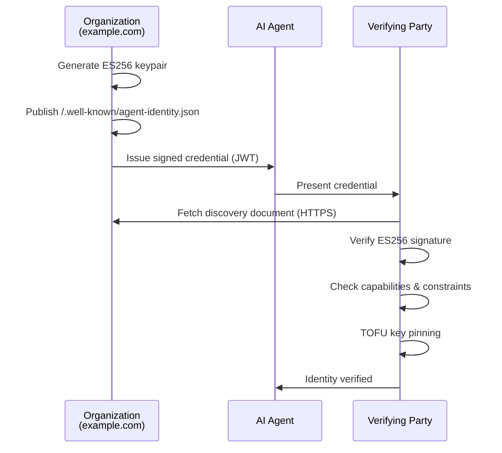

AI agents are increasingly acting on our behalf — reading email, writing code, managing infrastructure, negotiating with other agents. But there's a fundamental gap in this ecosystem: **when an agent claims to be "Scout v2 from Tarnover LLC," how does anyone verify that claim?**

Today we're introducing [**AgentPin**](https://github.com/thirdkeyai/agentpin) — a domain-anchored cryptographic identity protocol for AI agents. AgentPin is the second layer in the ThirdKey trust stack, sitting between [SchemaPin](https://schemapin.org) (tool integrity) and [Symbiont](https://symbiont.dev) (runtime policy enforcement).

## The Problem: Agent Identity is Self-Asserted

In today's agent ecosystem, identity is essentially honor-system. An agent says who it is, and everyone trusts that claim. This creates several critical attack vectors:

- **Agent Impersonation**: A malicious agent claims to be a trusted internal agent, gaining access to sensitive systems
- **Unauthorized Delegation**: An agent claims it was authorized by another agent when no such delegation exists
- **Phantom Agents**: Agents with no verifiable provenance operate freely within an organization
- **Capability Inflation**: An agent authorized for read-only access claims write permissions

These aren't theoretical risks. As multi-agent systems grow — agents calling agents, delegating tasks, sharing context — the attack surface expands exponentially. Without cryptographic identity verification, a single impersonating agent can compromise an entire agent network.

## The Solution: Domain-Anchored Cryptographic Identity

AgentPin solves this by anchoring agent identity to domain ownership, using the same trust model that secures the web. Organizations publish cryptographic identity documents at well-known HTTPS endpoints, issue short-lived credentials to their agents, and verifiers check those credentials against the published documents.

No centralized registry. No blockchain. Just ECDSA P-256 signatures and DNS — infrastructure that already exists.



## How AgentPin Works

### Discovery Documents

Organizations publish agent identity documents at `/.well-known/agent-identity.json`. These documents declare the organization's public keys, registered agents, their capabilities, and constraints:

```json
{
  "issuer": "example.com",
  "keys": [{
    "kid": "example-2026-01",
    "kty": "EC",
    "crv": "P-256",
    "x": "...",
    "y": "..."
  }],
  "agents": [{
    "agent_id": "urn:agentpin:example.com:scout",
    "name": "Scout Agent",
    "status": "active",
    "capabilities": ["read:codebase", "write:reports"],
    "constraints": {
      "max_data_classification": "internal"
    }
  }]
}
```

### Agent Credentials

Agents carry short-lived ES256 JWTs — signed by the organization's private key, verifiable by anyone with access to the discovery document. Credentials include the agent's identity, scoped capabilities, and expiration:

```
eyJhbGciOiJFUzI1NiIsInR5cCI6ImFnZW50cGluLWNyZWRlbnRpYWwrand0Iiwia2lkIjoiZXhhbXBsZS0yMDI2LTAxIn0...
```

Decoded, this contains:

```json
{
  "iss": "example.com",
  "sub": "urn:agentpin:example.com:scout",
  "capabilities": ["read:codebase", "write:reports"],
  "exp": 1739500800,
  "iat": 1739497200,
  "jti": "unique-credential-id"
}
```

Credentials are deliberately short-lived (recommended 1 hour or less) to limit the blast radius of a compromise.

### 12-Step Verification

Verification is rigorous and deterministic. The protocol specifies 12 ordered steps — from JWT parsing through signature verification, revocation checking, capability validation, delegation chain verification, and TOFU key pinning. Every step must pass for a credential to be accepted.

This isn't just signature checking. The verifier confirms that the agent is active, that claimed capabilities are a subset of what the organization declared, that constraints are at least as restrictive as the organization's policy, and that the signing key hasn't been seen before under a different domain (TOFU pinning).

### Revocation

Organizations publish a separate revocation document at `/.well-known/agent-identity-revocations.json` with three levels of granularity:

- **Credential revocation**: Revoke a specific credential by its `jti`
- **Agent revocation**: Revoke all credentials for a specific agent
- **Key revocation**: Revoke an entire signing key (emergency rotation)

Revocation documents are cached for at most 300 seconds, enabling rapid response to compromise.

## The Trust Stack

AgentPin doesn't operate in isolation. It's the identity layer in a three-layer trust architecture:

| Layer | Protocol | Question |
|-------|----------|----------|
| Tool Integrity | [SchemaPin](https://schemapin.org) | Are this agent's tools legitimate and untampered? |
| **Agent Identity** | **AgentPin** | **Is this agent who it claims to be?** |
| Runtime Policy | [Symbiont](https://symbiont.dev) | Does policy allow this agent to perform this action? |

SchemaPin verifies that the tools an agent uses haven't been tampered with. AgentPin verifies that the agent itself is legitimate and authorized. Symbiont enforces runtime policy based on both verifications. Together, they provide zero-trust security for the entire agent lifecycle.

The protocols share infrastructure by design: same cryptography (ECDSA P-256), same discovery pattern (`.well-known` endpoints), same TOFU model. Discovery documents cross-reference each other — an AgentPin document can include a `schemapin_endpoint` field, enabling verifiers to check both identity and tool integrity in a single flow.

## Quick Start

### Generate Keys and Issue a Credential

```bash
# Generate an ES256 keypair
agentpin keygen \
  --domain example.com \
  --kid example-2026-01 \
  --output-dir ./keys

# Issue a credential for an agent
agentpin issue \
  --private-key ./keys/example-2026-01.private.pem \
  --kid example-2026-01 \
  --issuer example.com \
  --agent-id "urn:agentpin:example.com:scout" \
  --capabilities "read:codebase,write:reports" \
  --ttl 3600
```

### Verify a Credential

```bash
# Online verification (fetches discovery document from .well-known)
agentpin verify --credential <jwt>

# Offline verification (uses local discovery document)
agentpin verify \
  --credential <jwt> \
  --discovery ./agent-identity.json \
  --pin-store ./pins.json
```

### Serve Discovery Documents

```bash
# Start the .well-known endpoint server
agentpin-server \
  --discovery ./agent-identity.json \
  --revocation ./revocations.json \
  --port 8080
```

## Cross-Language Support

AgentPin ships with implementations in Rust, JavaScript, and Python — all producing interoperable credentials. A JWT issued in Python verifies identically in Rust or JavaScript.

- **Rust**: Core library with no mandatory HTTP dependency, plus CLI and Axum server
- **JavaScript**: Zero external dependencies, runs in Node.js and browsers
- **Python**: Uses the `cryptography` library for ECDSA operations

## Enterprise Features

### Trust Bundles

For air-gapped or high-security environments, AgentPin supports **trust bundles** — pre-packaged collections of discovery and revocation documents that can be distributed out-of-band. This enables offline verification without any network calls.

### Delegation Chains

AgentPin supports a two-layer delegation model: a **Maker** (the software developer who created the agent) and a **Deployer** (the organization running a specific instance). Each layer is cryptographically attested, and capabilities can only narrow through delegation — never widen.

### Mutual Authentication

Both parties can verify each other through a challenge-response protocol with 128-bit nonces. The agent proves its identity to the service, and the service proves its identity to the agent. Nonces expire in 60 seconds, preventing replay attacks.

## Getting Started

AgentPin is open source and available today:

- **Source**: [github.com/thirdkeyai/agentpin](https://github.com/thirdkeyai/agentpin)
- **Rust crate**: `cargo add agentpin`
- **npm**: `npm install agentpin`
- **PyPI**: `pip install agentpin`

The [specification](https://github.com/thirdkeyai/agentpin/blob/main/SPEC.md) is comprehensive and implementation-ready, with detailed security considerations, error handling guidance, and interoperability requirements.

## What's Next

As multi-agent systems move from research to production, cryptographic identity becomes non-negotiable infrastructure. Without it, every agent interaction is built on trust assumptions that attackers can exploit.

AgentPin provides the identity foundation. Combined with SchemaPin for tool integrity and Symbiont for runtime enforcement, it enables organizations to deploy autonomous agents with the same cryptographic guarantees they expect from human-facing systems.

---

*AgentPin is part of ThirdKey Research's Zero Trust for AI initiative. Learn more at [research.thirdkey.ai](https://research.thirdkey.ai).*
