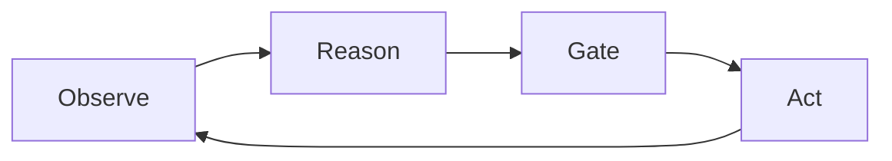

Every agent framework has a loop. Call the LLM, parse the tool calls, execute them, feed the results back. ReAct, AutoGPT, LangGraph, CrewAI — the shape is always the same. What differs is what happens when things go wrong, and more importantly, what *can't* happen at all.

Symbiont's reasoning loop is called **ORGA** — Observe, Reason, Gate, Act. The name is deliberate: the "Gate" phase isn't optional middleware or a plugin. It's a compile-time-enforced phase of execution that every agent action must pass through before it can reach the outside world.

This post introduces the architecture, explains the four innovations that make it novel, and walks through how they work together.

## The Problem with "Policy as Middleware"

Most agent frameworks treat safety as a layer you bolt on. A callback before tool execution. A filter on the output. An approval queue in a dashboard somewhere. These approaches share a failure mode: they can be bypassed, forgotten, or misconfigured.

Consider a typical agent loop:

```
LLM generates tool call → Execute tool → Return result → Repeat
```

Where does policy go? Usually one of two places:

1. **Before execution** — a hook that checks whether the tool call is allowed. If someone forgets to register the hook, the tool runs anyway.
2. **After generation** — a filter on the LLM's output. If the output format changes slightly, the filter misses it.

Both approaches treat policy as external to the loop's core logic. The loop *works* without them. That's the problem.

## ORGA: Policy as a Mandatory Phase

ORGA restructures the agent loop so that policy evaluation is a phase transition — the same kind of primitive as "call the LLM" or "execute the tool." You can't skip it any more than you can skip reasoning.



Each phase is a distinct type in Rust's type system. The loop physically cannot progress from Reason to Act without passing through Gate, because the compiler won't let you call `dispatch_tools()` on a value of type `AgentLoop<PolicyCheck>` — only `check_policy()` is available. And `dispatch_tools()` only exists on `AgentLoop<ToolDispatching>`, which you can only obtain from a successful policy check.

This is enforced at compile time. Not at runtime. Not by convention. By the type checker.

## The Four Pillars

ORGA's novelty isn't any single technique — it's combining four mechanisms into a single runtime primitive:

### 1. Typestate-Enforced Phase Ordering

Each phase of the loop is a zero-sized type marker that implements the `AgentPhase` trait:

```rust
pub trait AgentPhase {}

pub struct Reasoning;
pub struct PolicyCheck;
pub struct ToolDispatching;
pub struct Observing;

impl AgentPhase for Reasoning {}
impl AgentPhase for PolicyCheck {}
impl AgentPhase for ToolDispatching {}
impl AgentPhase for Observing {}

pub struct AgentLoop<Phase: AgentPhase> {
    pub state: LoopState,
    pub config: LoopConfig,
    _phase: PhantomData<Phase>,
}
```

Phase transitions consume `self` and return the next phase:

```rust
impl AgentLoop<Reasoning> {
    pub async fn produce_output(self, ...)
        -> Result<AgentLoop<PolicyCheck>, LoopTermination>;
}

impl AgentLoop<PolicyCheck> {
    pub async fn check_policy(self, gate: &dyn ReasoningPolicyGate)
        -> Result<AgentLoop<ToolDispatching>, LoopTermination>;
}

impl AgentLoop<ToolDispatching> {
    pub async fn dispatch_tools(self, ...)
        -> Result<AgentLoop<Observing>, LoopTermination>;
}

impl AgentLoop<Observing> {
    pub fn observe_results(self) -> LoopContinuation;
}
```

Each transition method is only defined on its phase type. `AgentLoop<Reasoning>` has `produce_output()` but not `dispatch_tools()`. `AgentLoop<ToolDispatching>` has `dispatch_tools()` but not `check_policy()`. The move semantics mean the old phase is consumed — you can't hold onto both sides of a transition.

Invalid phase orderings aren't runtime errors. They're compile errors. You literally cannot write code that skips the Gate.

### 2. Policy-as-Phase

The Gate is implemented through the `ReasoningPolicyGate` trait:

```rust
#[async_trait]
pub trait ReasoningPolicyGate: Send + Sync {
    async fn evaluate_action(
        &self,
        agent_id: &AgentId,
        action: &ProposedAction,
        state: &LoopState,
    ) -> LoopDecision;
}
```

Every action the LLM proposes — tool calls, delegations, responses, terminations — is submitted to the gate. The gate returns one of three decisions:

- **Allow**: Action proceeds to dispatch
- **Deny**: Action is blocked, and the denial reason is fed back to the LLM as an observation
- **Modify**: Action is structurally rewritten — the gate returns a new `ProposedAction` that replaces the original in the dispatch queue. This is used for parameter redaction (e.g., stripping sensitive fields before a tool call reaches an external API) while preserving the action's intent.

The denial feedback loop is key. A denied action doesn't crash the agent or terminate the loop. The LLM learns *why* the action was denied and can try a different approach. The agent self-corrects within policy boundaries.

Symbiont ships three gate implementations:

| Gate | Use Case |
|------|----------|
| `DefaultPolicyGate` | Delegates to the DSL policy engine |
| `CedarPolicyGate` | Formal authorization via AWS Cedar policies |
| `ToolFilterPolicyGate` | Simple allowlist/denylist for tool names |

A Cedar policy example:

```cedar
// Allow all agents to respond to users
permit(principal, action == Action::"respond", resource);

// Forbid any agent from calling the delete tool
forbid(principal, action == Action::"tool_call::delete_production_db", resource);
```

Note: Symbiont uses the Cedar policy language directly. If you're using AWS Verified Permissions (which adds its own constraints on top of Cedar), you'll need to scope principal and resource types to satisfy its stricter validation rules.

The gate is never optional. Even with no explicit policy configured, a `DefaultPolicyGate` evaluates every action. The zero-policy case is "allow all" — but it's still *evaluated*, still journaled, still auditable.

### 3. Durable Journaling

Every phase transition emits a journal entry:

```rust
pub struct JournalEntry {
    pub sequence: u64,
    pub timestamp: DateTime<Utc>,
    pub agent_id: AgentId,
    pub iteration: u32,
    pub event: LoopEvent,
}

pub enum LoopEvent {
    Started { agent_id: AgentId, config: LoopConfig },
    ReasoningComplete { iteration: u32, actions: Vec<ProposedAction>, usage: Usage },
    PolicyEvaluated { iteration: u32, action_count: usize, denied_count: usize },
    ToolsDispatched { iteration: u32, tool_count: usize, duration: Duration },
    ObservationsCollected { iteration: u32, observation_count: usize },
    Terminated { reason: TerminationReason, iterations: u32, total_usage: Usage, duration: Duration },
}
```

Journal writes happen immediately after each phase completes, before the next phase begins. This means a crashed loop can recover from the last completed phase without re-invoking the LLM. If the agent crashes after `ReasoningComplete` is persisted but before policy evaluation runs, the recovery path knows the LLM's proposed actions and can resume from the policy check. For tool dispatch specifically, the `DurableJournal` records intent before dispatch and completion after, so side-effectful tools can use idempotency keys to avoid double-execution on recovery.

Two journal backends ship with the runtime:

- **`BufferedJournal`**: In-memory ring buffer (default, fast, ephemeral)
- **`DurableJournal`**: Persistent storage via a pluggable `JournalStorage` trait for production workloads

The journal is also the foundation for observability. Every iteration's token usage, tool dispatch latency, policy denial count, and termination reason is recorded. You don't need to instrument the loop — the loop instruments itself.

### 4. Cryptographic Audit

For high-assurance deployments, Symbiont extends journaling with a hash-chained, Ed25519-signed audit trail:

```rust
pub struct CriticAuditEntry {
    pub entry_id: String,
    pub director_output_hash: String,    // SHA-256 of LLM output
    pub critic_assessment_hash: String,  // SHA-256 of evaluation
    pub verdict: AuditVerdict,           // Approved, Rejected, NeedsRevision
    pub chain_hash: String,              // SHA-256(prev_hash || entry_data)
    pub signature: String,               // Ed25519 over chain_hash
    pub timestamp: DateTime<Utc>,
}
```

Each entry's `chain_hash` is computed from the previous entry's hash concatenated with the current entry's data (serialized canonically to avoid encoding ambiguity), then signed with Ed25519. This creates a tamper-evident hash chain: modifying any entry invalidates all subsequent signatures.

Verification recomputes the chain from genesis and checks every signature:

```rust
pub fn verify_chain(
    entries: &[CriticAuditEntry],
    verifying_key: &VerifyingKey,
) -> Result<(), AuditError>
```

If an entry has been modified, inserted, deleted, or reordered, verification fails with the exact index of the first inconsistency. This isn't just logging — it's a cryptographic proof of what the agent did, in what order, and what policy decisions were made.

## How It All Fits Together

The `ReasoningLoopRunner` orchestrates the full cycle:

```rust
async fn run_inner(&self, state: LoopState, config: LoopConfig) -> LoopResult {
    let agent_id = state.agent_id;
    let mut current_loop = AgentLoop::<Reasoning>::new(state, config);

    loop {
        // OBSERVE: inject knowledge, manage context
        if let Some(ref bridge) = self.knowledge_bridge {
            bridge.inject_context(&agent_id, &mut current_loop.state.conversation).await.ok();
        }

        // REASON: call inference provider
        let policy_phase = current_loop
            .produce_output(self.provider.as_ref(), self.context_manager.as_ref())
            .await?;
        self.journal.append(/* ReasoningComplete */).await;

        // GATE: evaluate every proposed action
        let dispatch_phase = policy_phase
            .check_policy(self.policy_gate.as_ref())
            .await?;
        self.journal.append(/* PolicyEvaluated */).await;

        // ACT: execute approved actions
        let observe_phase = dispatch_phase
            .dispatch_tools(self.executor.as_ref(), self.circuit_breakers.as_ref())
            .await?;
        self.journal.append(/* ToolsDispatched */).await;

        // OBSERVE: decide whether to continue or terminate
        match observe_phase.observe_results() {
            LoopContinuation::Continue(next) => current_loop = *next,
            LoopContinuation::Complete(result) => return result,
        }
    }
}
```

Notice the type transitions: `current_loop` starts as `AgentLoop<Reasoning>`, becomes `AgentLoop<PolicyCheck>` after reasoning, becomes `AgentLoop<ToolDispatching>` after the gate, becomes `AgentLoop<Observing>` after dispatch, and then either becomes a fresh `AgentLoop<Reasoning>` for the next iteration or terminates.

The builder enforces required dependencies at compile time too:

```rust
let runner = ReasoningLoopRunner::builder()
    .provider(cloud_provider)     // Required — won't compile without
    .executor(tool_executor)      // Required — won't compile without
    .policy_gate(cedar_gate)      // Optional — defaults to permissive
    .journal(durable_journal)     // Optional — defaults to in-memory
    .build();
```

## Why This Combination Matters

Each of these techniques exists independently. Typestate patterns are well-known in Rust (and have been applied in robotics and concurrent systems). Policy engines are commodity. Append-only logs are everywhere. Hash chains are textbook cryptography.

The novelty is combining all four into a single agent runtime primitive where:

- **Phase ordering is compile-time**: You can't write an agent that skips policy
- **Policy is a phase**: Not middleware, not a hook — a mandatory state transition
- **Every transition is journaled**: Crash recovery without LLM re-invocation
- **The journal is cryptographically chained**: Tamper-evident proof of agent behavior

No existing agent framework provides all four. Most provide zero or one. The result is a runtime where "the agent did X without authorization" is not a failure mode — it's a type error, for any code path that goes through the ORGA API.

To be precise: this guarantee covers actions executed via the reasoning loop. Defense-in-depth still applies at the tool boundary — least-privilege credentials, network egress controls, and sandboxing remain important for the external services that tools invoke. ORGA ensures the agent runtime itself cannot skip policy; it doesn't replace infrastructure-level controls on what those tools can reach.

There is a cost: every iteration runs a policy evaluation and a journal write, even when the policy is permissive. In practice, these are microsecond-scale operations against the seconds-scale latency of LLM inference, so the overhead is negligible. Cryptographic signing (for the audit chain) is more expensive and is opt-in for deployments that need tamper-evident logs. The runtime also includes per-tool circuit breakers and configurable concurrency limits to handle partial failures without cascading into the rest of the agent fleet.

## Getting Started

Symbiont is open source under the Apache 2.0 license:

```bash
# Install
cargo install symbi

# Or via Docker
docker pull ghcr.io/thirdkeyai/symbi:latest
```

The ORGA loop is the core of every agent built with Symbiont — from simple tool-calling assistants to fleet-managed autonomous agents with external integrations.

- **Source**: [github.com/thirdkeyai/symbiont](https://github.com/thirdkeyai/symbiont)
- **Documentation**: [symbiont.dev](https://symbiont.dev)
- **SDKs**: [Python](https://pypi.org/project/symbiont-sdk/) and [JavaScript](https://www.npmjs.com/package/symbiont-sdk-js) wrappers available

---

*ORGA is part of the [Symbiont](https://symbiont.dev) agent runtime, built by [ThirdKey AI](https://thirdkey.ai). It integrates with [SchemaPin](https://schemapin.org) for tool integrity and [AgentPin](https://agentpin.org) for cryptographic agent identity.*
