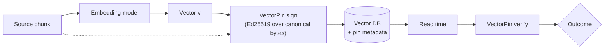
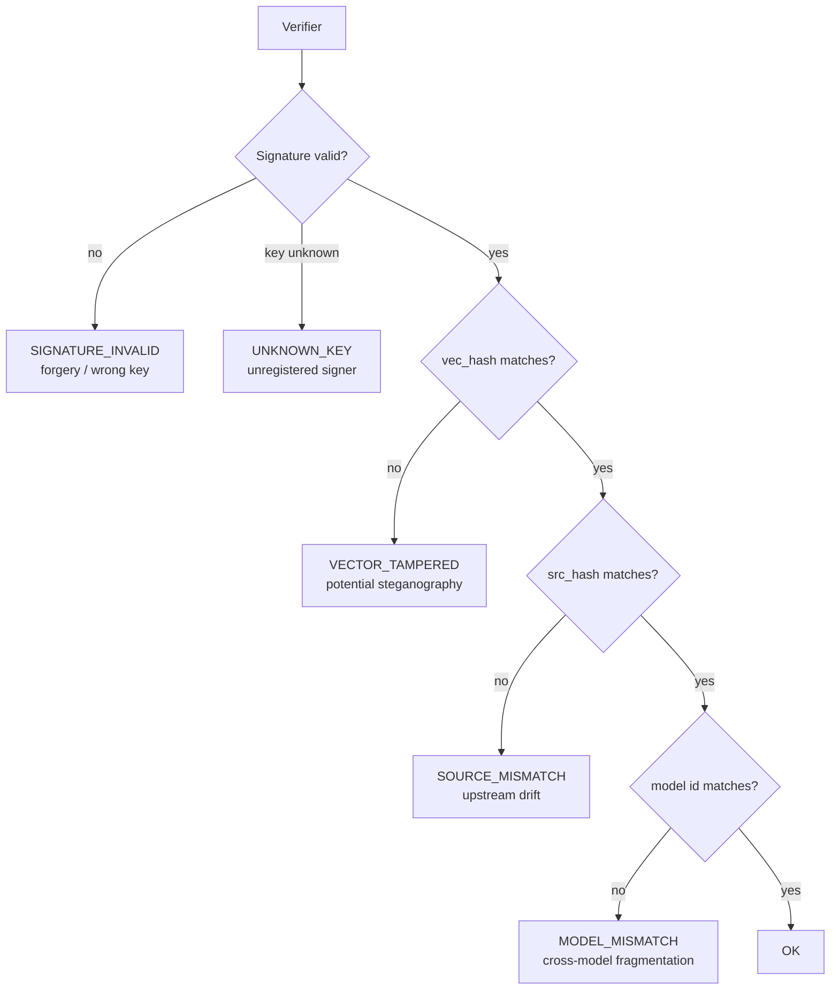

*A new ThirdKey Research preprint on steganographic exfiltration in embedding stores, and a cryptographic provenance defense.*

**Jascha Wanger &mdash; ThirdKey AI Research**

---

We're publishing **VectorSmuggle: Steganographic Exfiltration in Embedding Stores and a Cryptographic Provenance Defense**, a new ThirdKey Research preprint on a layer of AI infrastructure that has quietly become security-sensitive without quite being treated that way.

Paper: [https://doi.org/10.5281/zenodo.20058255](https://doi.org/10.5281/zenodo.20058255)

The short version is that vector embeddings have become load-bearing in modern AI systems, but production vector databases ship no native controls for verifying that an embedding hasn't been modified after the model produced it. The paper studies what an attacker can do with that gap, and what it takes to close it.

## The setup

A retrieval-augmented generation pipeline does three things. It chunks documents and runs each chunk through an embedding model. It stores the resulting vectors in a vector database with the source text as metadata. At query time it embeds the user's question and returns the nearest stored vectors as context for the LLM.

That pipeline now sits underneath enterprise knowledge bases, support agents, legal research, medical workflows, and an expanding set of agentic systems. Its security model has not really kept up. Vector databases have authentication, TLS, encryption at rest, and access logs. None of those reach into the floating-point content of the vectors themselves. We surveyed seven production systems for the paper and found the same gap across all of them: no ingestion-time integrity checks, no provenance attestation, no tamper-evident audit trail for post-ingestion changes.

The reason is historical. Vector databases were optimized for recommendation and public-facing semantic search, where the embeddings were not confidential and integrity attacks were not part of the threat model. The recent re-purposing as a substrate for confidential RAG has happened faster than the security model has been re-examined. This is the same arc DNS, HTTP/3, and default-public S3 buckets all went through.

## The attack class

The paper studies steganographic exfiltration. An attacker with write access to the ingestion pipeline hides payload data inside embeddings while preserving the surface-level retrieval behavior the RAG system exposes to legitimate users. An accomplice with read access to the vector store later decodes the payload.

We evaluated six families of post-embedding modifications: additive Gaussian noise, orthogonal rotation, magnitude scaling, fixed offset, cross-model fragmentation, and sequential combinations. The threat model is explicit: this is the insider-with-backup-access case, where the attacker can write to ingestion and read backups but cannot directly exfiltrate source documents because those pass through DLP or live in a data room they don't have direct access to.

The honest finding has two parts.

First, distribution-shifting techniques have a narrow stealth window. Off-the-shelf anomaly detectors (Isolation Forest, One-Class SVM with an RBF kernel) trained on a clean baseline catch every operating point that meaningfully moves the embedding direction. Noise at sigma = 0.005 already preserves cosine similarity at 0.964 but is detectable by One-Class SVM at AUC 0.796. By sigma = 0.01 both detectors reach AUC 1.000. The good news for defenders: the obvious statistical baseline closes most of the cheap-attack regime.

Second, orthogonal rotation is the structural exception in the small-angle, few-rotation regime. Rotation preserves all pairwise inner products and per-dimension marginal moments by construction, which is exactly the feature surface that distribution-based detectors fit on. Across a 35-point parameter sweep, neither detector exceeded AUC 0.53. The result replicates across four additional embedding models (Nomic, EmbeddingGemma, Snowflake Arctic, MXBai) and across two cross-corpus replications totalling over 26,000 chunks (BEIR NFCorpus and a Quora subset). Rotation AUC stays at chance to three decimal places on every (model, corpus) pair we tested.

| Technique                          | Cos to original | IsoForest AUC | OC-SVM AUC |
| ---------------------------------- | --------------- | ------------- | ---------- |
| Gaussian noise (sigma = 0.005)     | 0.964           | 0.50          | 0.796      |
| Gaussian noise (sigma = 0.01)      | 0.929           | 1.000         | 1.000      |
| Orthogonal rotation (small angle)  | ~1.00           | ~0.50         | ~0.50      |
| Orthogonal rotation (35-pt sweep)  | varies          | <= 0.53       | <= 0.53    |
| Adaptive PGD (L2-budgeted)         | > 0.99          | ~0            | ~0         |

There's a third wrinkle worth flagging. Against an adaptive attacker with white-box access to the detector, projected-gradient descent within an L2 budget drives both detector AUCs to near-zero while keeping cosine to original above 0.99. Statistical detection is useful as a first filter against casual attackers. It is not a load-bearing security control against attackers who have read the literature.

## The capacity question

A natural follow-up: if rotation is undetectable in that regime, how much payload can it actually carry?

We worked out the closed-form answer. For an attacker who shares a key with the receiver selecting K disjoint dimension pairs, encoding b bits per pair as a quantized Givens rotation angle, the per-vector capacity is floor(d/2) times b bits. At d = 3072 (matching text-embedding-3-large) and b = 10, that's 15,360 bits per vector, or about 1.9 KB.

The encoder/decoder works. We round-trip arbitrary payloads at zero bit error rate under float32 and float16 storage across 21 operating points.

The detection picture is more nuanced. On a synthetic Gaussian baseline both detectors stay at chance across the full sweep, including the full-capacity operating point. On the real text-embedding-3-large corpus, the same protocol becomes detectable at moderate K: One-Class SVM AUC reaches 0.92 at 256 byte payloads and 1.00 at 512 bytes. The reason is that real corpus embeddings cluster on a tighter manifold than uniform-on-the-sphere, and a random-angle disjoint Givens rotation pushes samples off it.

So there's a real capacity-detectability trade-off on production embeddings. The capacity ceiling is dimension-only. The retrieval-preserving operating point (where cos to original stays above 0.7) sits well below the ceiling, at hundreds of bytes per vector. And the small-angle, few-rotation regime that drives the cos near 1.0 evasion result remains undetectable on real corpora at the parameters used in the headline detection table. A defender relying on distribution-based detection has to commit to a training-set coverage assumption that is hard to verify in practice.

## What survives a real vector store

A reviewer-shaped concern is whether quantization or ANN indexing silently destroys the bit channel. We ran the same techniques against seven configurations: FAISS-flat, FAISS-HNSW, FAISS IVF-PQ at m=8 and m=16, Chroma, Qdrant float32, and Qdrant with scalar int8 quantization enabled.

Five of the seven preserve the attacker's payload identically. Qdrant's default scalar int8 quantization is a search-time artifact: it affects internal distance computations during HNSW traversal but `retrieve()` returns the unquantized float32 original, so the bit channel is preserved verbatim. Operators who hoped quantization would destroy hidden payloads should know that the most common production quantization mode does not.

Product quantization is the one configuration that materially narrows the channel. At m=8 the recover-cosine drops to roughly 0.76 on every technique, including clean. At m=16 the floor is 0.88. The narrowing is attacker-independent, which is an important caveat: it's a side effect of memory optimization, not an intentional integrity control. Operators using PQ get a side benefit accidentally. Operators using anything else don't.

## Why detection isn't enough

The paper's central finding, stated honestly, is this: statistical detection is a useful first filter, but its durability depends on preconditions that an operator can't unilaterally enforce. No rotation in the small-angle regime. No adaptive attacker. Sufficient training-set coverage of the local manifold geometry. Lose any one of those and the detector becomes probabilistic deterrence rather than a security control.

This is the structural argument for moving the integrity question off the distributional layer entirely.

## VectorPin

The constructive half of the paper is **VectorPin**, a minimal cryptographic provenance protocol for embedding integrity.

The idea is straightforward. When the embedding service produces a vector, it signs a canonical commitment over the source content hash, the model identifier, the vector hash, the dimension and dtype, a timestamp, the key id, and any operator-provided metadata. The signature is Ed25519 over a deterministic byte form of those fields. Verification on read recomputes the relevant hashes and checks the signature. Any post-embedding modification breaks `vec_hash` and triggers a `VECTOR_TAMPERED` outcome.

The verifier returns distinct outcomes for distinct failures: `SIGNATURE_INVALID` for forgery, `VECTOR_TAMPERED` for post-pin modification, `SOURCE_MISMATCH` for source drift, `MODEL_MISMATCH` for cross-model substitution, `UNKNOWN_KEY` for unregistered signers. Operators route on these differently. A vector tampering is potential steganography. A model mismatch is potential cross-model fragmentation. A source mismatch may simply be upstream pipeline drift.

The coverage relative to the studied attacks is structural rather than empirical. Every perturbation technique in the paper modifies the stored vector after the model produced it. Each modification therefore changes `vec_hash` and fails verification. Cross-model fragmentation is caught by the `model` field. There is no operating point of any of these techniques that VectorPin doesn't catch, because the protocol commits to the actual model output and any deviation is detectable by anyone holding the public key.

We use vanilla Ed25519 over SHA-256. The cryptographic primitives are not novel and they aren't supposed to be. The contribution is the canonical byte form for floating-point arrays, the wire-format design, and the cross-language compatibility discipline.

Reference implementations ship in Python and Rust under Apache 2.0, locked together by shared test vectors that gate every change to either side. A drift-detection job in CI regenerates the fixtures on every Python-side change and fails the build if the regenerated bytes differ from what's committed, so a seemingly-innocuous serialization change can't silently break Rust verification. JavaScript and Go ports are next.

The Rust port matters because Rust runtimes (Symbiont among them) are increasingly the boundary at which RAG-derived data is consumed by agents. Verification has to happen in-process, without a polyglot sidecar.

## Provenance over guessing

The framing we propose for the security community: embedding-level integrity is a deployable, standardizable control. It is not a fundamental property of vector databases as built today, and it can become one without inventing new cryptography.

A statistical detector asks "does this vector look anomalous." That's useful, but it's probabilistic, training-data-dependent, and brittle against adaptive attackers. A signed commitment asks "does this vector match what the producer attested." Either it does or it doesn't.

The two layers are complementary rather than competing. Detection closes the cheap-attack regime where signatures haven't been deployed. Provenance closes the durable-attack regime where rotation slips past detectors and adaptive attackers slip past everything else. A defense story that includes both is closed against the threat model in the paper. Either one alone leaves residue.

## What VectorPin doesn't do

The protocol defends a chain of custody after a known-good ingestion event. It does not validate the ingestion event itself. An attacker who controls the signing pipeline can sign whatever vector they want, and verification will succeed. An attacker who modifies the source document before embedding gets an honest signature over the modified content. An attacker who steals the private signing key produces arbitrary valid pins.

These are not bugs in the protocol. They are scope boundaries we set explicitly. Pre-ingestion content integrity controls (signed source documents, in-toto attestations on the ingestion pipeline) and standard secret-management practice (KMS, HSM, time-bounded keys, rotation) remain necessary and complementary. The point of writing the limits down is so that a deployment can match each non-claim to the relevant upstream control rather than discovering the gap during an incident.

## Where this fits

RAG security conversations have largely been about prompt injection at the LLM boundary. That's the visible layer and it's gotten the attention it deserves. The retrieval substrate underneath has gotten less.

Embeddings are not search hints anymore. They are part of the trust boundary that decides what an AI system sees, what it retrieves, and what it treats as relevant. For agents that act on retrieved content, embeddings are part of the chain that produces real-world effects.

A layer that load-bearing should be verifiable. The components to make that practical (Ed25519, SHA-256, canonical byte forms, signed metadata) have been deployed in adjacent provenance systems for years (sigstore for software artifacts, in-toto for build pipelines, C2PA for media, SchemaPin for tool schemas). The work was applying the design family to a new substrate and shipping reference implementations that interoperate cleanly across the languages that real RAG pipelines are built in.

What we'd like to see next is one of the major vector database vendors shipping native pin verification as a built-in feature. That's the lowest-friction adoption path: it bypasses third-party library integration, makes the control auditable through the vendor's compliance attestations, and puts competitive pressure on the rest of the category. The OSS-first release strategy is partly designed to make that adoption tractable. The protocol is open, the references are Apache 2.0, and the cross-language fixtures mean a vendor can adopt it in their own codebase without coupling to ours.

Embedding integrity should be a normal part of secure RAG architecture. Today it isn't. That gap is closeable, the closure is cheap, and the work is sitting on GitHub.

Paper: [https://doi.org/10.5281/zenodo.20058255](https://doi.org/10.5281/zenodo.20058255)

VectorPin: [https://github.com/ThirdKeyAI/VectorPin](https://github.com/ThirdKeyAI/VectorPin)

VectorSmuggle: [https://github.com/jaschadub/VectorSmuggle](https://github.com/jaschadub/VectorSmuggle)
